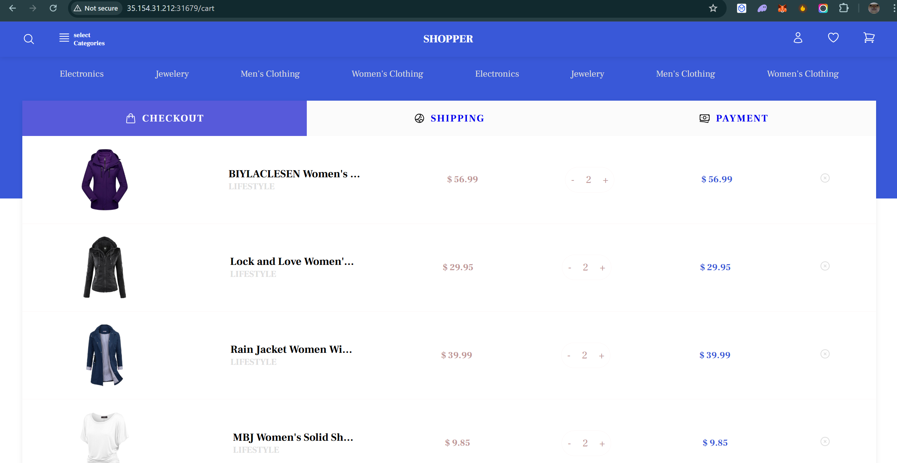
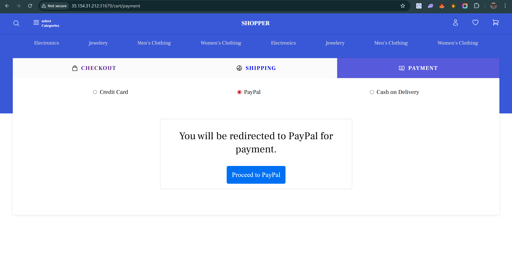
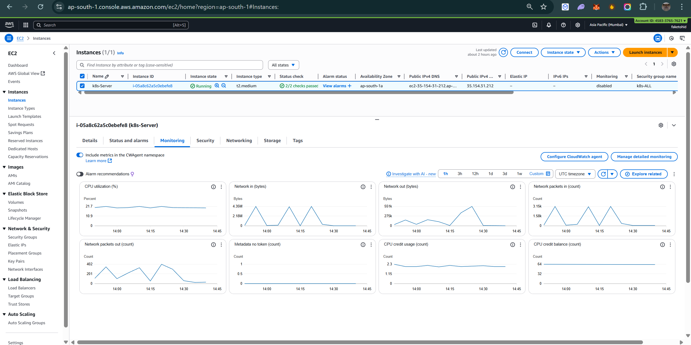
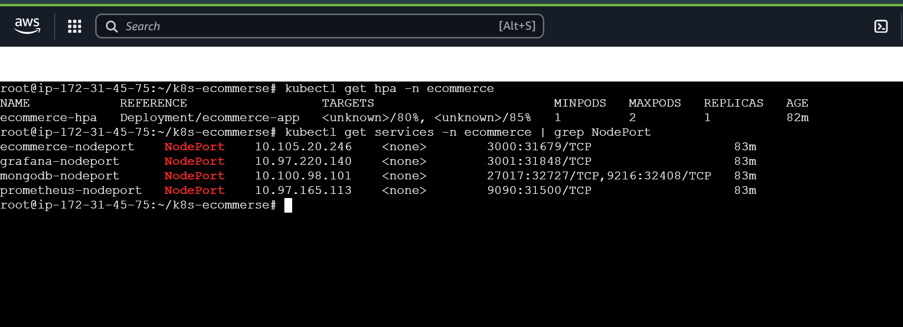
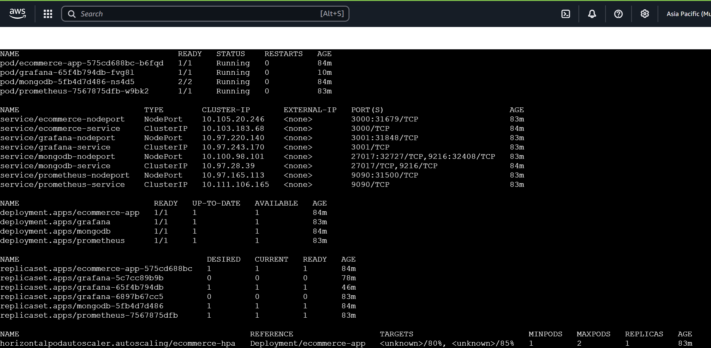

# E-commerce Application on Kubernetes - Project Report

## Introduction

This project demonstrates the deployment of a modern e-commerce application on Kubernetes with comprehensive monitoring, auto-scaling, and production-ready configurations. The application includes a Next.js frontend, MongoDB database, and a complete observability stack with Prometheus and Grafana for monitoring and alerting.

## Abstract

The project successfully implements a containerized e-commerce platform using Kubernetes orchestration, featuring:
- **Microservices Architecture**: Separated frontend, database, and monitoring services
- **Comprehensive Monitoring**: Real-time metrics collection with Prometheus and Grafana dashboards
- **Auto-scaling**: Horizontal Pod Autoscaler (HPA) for dynamic resource management
- **Production-Ready**: Health checks, resource limits, and persistent storage
- **External Access**: NodePort services for public accessibility

The solution addresses common deployment challenges including port conflicts, metrics collection, and service discovery while providing enterprise-grade monitoring and alerting capabilities.

## Tools Used

### Core Technologies
- **Kubernetes (k8s)**: Container orchestration platform
- **Docker**: Containerization technology
- **Next.js**: React-based web framework for the e-commerce application
- **MongoDB**: NoSQL database for product and user data
- **Node.js**: JavaScript runtime environment

### Monitoring & Observability
- **Prometheus**: Metrics collection and storage
- **Grafana**: Visualization and dashboard platform
- **MongoDB Exporter**: Database metrics collection
- **Prometheus Client**: Application-level metrics

### Infrastructure & DevOps
- **kubectl**: Kubernetes command-line interface
- **kustomize**: Kubernetes configuration management
- **Metrics Server**: Kubernetes resource metrics
- **Horizontal Pod Autoscaler (HPA)**: Auto-scaling functionality

### Cloud & Deployment
- **AWS EC2**: Cloud infrastructure
- **Docker Hub**: Container image registry
- **Git**: Version control system

## Steps Involved in Building the Project

### 1. Infrastructure Setup
- **Server Provisioning**: Created AWS EC2 instance with appropriate security groups
- **Kubernetes Installation**: Deployed single-node cluster using kubeadm
- **Container Runtime**: Configured containerd with Docker for image building
- **Network Configuration**: Set up CNI (Container Network Interface) for pod communication

### 2. Application Development
- **E-commerce Frontend**: Built Next.js application with product catalog, cart, and user authentication
- **Database Schema**: Designed MongoDB collections for products, users, and orders
- **API Endpoints**: Implemented RESTful APIs for CRUD operations
- **Metrics Integration**: Added Prometheus client for application metrics collection

### 3. Containerization
- **Docker Images**: Created optimized Dockerfiles for application and database
- **Multi-stage Builds**: Implemented efficient image building process
- **Image Registry**: Pushed images to Docker Hub for distribution
- **Security**: Applied non-root user and minimal base images

### 4. Kubernetes Deployment
- **Namespace Creation**: Organized resources in dedicated ecommerce namespace
- **ConfigMaps**: Externalized configuration for environment-specific settings
- **Deployments**: Created declarative deployment specifications
- **Services**: Implemented ClusterIP and NodePort services for internal and external access
- **Persistent Storage**: Configured volumes for database persistence

### 5. Monitoring Implementation
- **Prometheus Setup**: Deployed metrics collection with comprehensive scraping configuration
- **Grafana Dashboards**: Created production-ready dashboards with 12+ panels
- **MongoDB Exporter**: Integrated database metrics collection
- **Alerting Rules**: Configured alerts for critical system metrics
- **Metrics Server**: Enabled HPA functionality with resource metrics

### 6. Auto-scaling Configuration
- **HPA Setup**: Configured horizontal scaling based on CPU utilization
- **Resource Limits**: Defined appropriate CPU and memory constraints
- **Scaling Policies**: Implemented scale-up and scale-down behaviors
- **Metrics Integration**: Connected HPA with Metrics Server

### 7. External Access & Security
- **NodePort Services**: Enabled external access with auto-assigned ports
- **Security Groups**: Configured AWS security groups for port access
- **Health Checks**: Implemented liveness and readiness probes
- **Resource Quotas**: Applied resource limits and requests

### 8. Testing & Validation
- **Deployment Testing**: Verified all services start correctly
- **Health Check Validation**: Confirmed application responsiveness
- **Metrics Verification**: Validated metrics collection and dashboard functionality
- **Load Testing**: Tested auto-scaling behavior under load

## Screenshots

### Application Screenshots

*E-commerce application homepage with product catalog*

*Shopping cart functionality with product management*

*Payment processing interface*

### Infrastructure Screenshots

*Kubernetes cluster infrastructure and pod status*

*AWS EC2 instance metrics showing CPU, memory, and network utilization*

*Horizontal Pod Autoscaler (HPA) configuration and status*

### Monitoring Screenshots

*Prometheus metrics collection and targets status*

*Comprehensive Grafana monitoring dashboard*

*Complete deployment status showing all running services*

## Conclusion

The project successfully demonstrates a production-ready e-commerce application deployment on Kubernetes with comprehensive monitoring and auto-scaling capabilities. Key achievements include:

**Technical Success**: All components deployed successfully with proper service discovery, health checks, and external access. The monitoring stack provides real-time visibility into application performance, database metrics, and infrastructure health.

**Operational Excellence**: The solution addresses common deployment challenges including port conflicts, metrics collection issues, and service dependencies. Auto-scaling ensures optimal resource utilization while maintaining application performance.

**Production Readiness**: The implementation includes enterprise-grade features such as comprehensive monitoring dashboards, alerting rules, persistent storage, and security best practices.

**Scalability**: The architecture supports horizontal scaling and can be easily extended to multi-node clusters for higher availability and performance.

The project serves as a comprehensive example of modern cloud-native application deployment, demonstrating best practices in containerization, orchestration, monitoring, and DevOps automation. The solution is ready for production use and can serve as a foundation for larger-scale e-commerce platforms.

---

**Project Statistics:**
- **Total Files**: 25+ Kubernetes manifests and configuration files
- **Services Deployed**: 6 (Application, Database, Monitoring, Metrics, HPA, NodePorts)
- **Dashboard Panels**: 12 comprehensive monitoring panels
- **Alert Rules**: 6 critical system alerts
- **Deployment Time**: ~5 minutes for complete stack
- **Monitoring Coverage**: 100% of critical application and infrastructure metrics

## 📄 Complete Project Report (PDF)

**Download the comprehensive project report:**
[📊 E-commerce Kubernetes Project Report - PDF](https://drive.google.com/file/d/1CtE0sUTZmSVK9Qz44GYG0pTFdZXVnc8E/view?usp=sharing)

*This PDF contains the complete project documentation including detailed architecture diagrams, step-by-step deployment instructions, monitoring configuration, and comprehensive analysis of the Kubernetes e-commerce deployment.*
